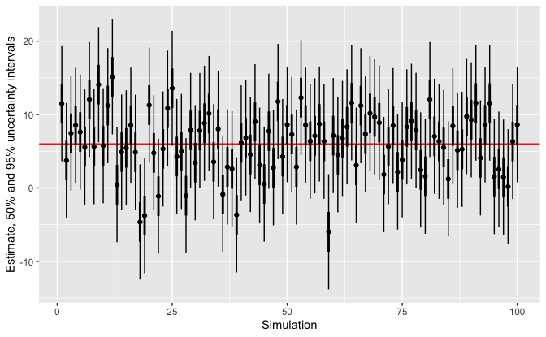

Regression and Other Stories: Coverage
================
Andrew Gelman, Jennifer Hill, Aki Vehtari
2020-12-21

-   [Data](#data)
-   [Plot](#plot)

Tidyverse version by Bill Behrman.

Coverage - Illustration of coverage of intervals. See Chapter 4 in
Regression and Other Stories.

------------------------------------------------------------------------

``` r
# Packages
library(tidyverse)

# Parameters
  # Common code
file_common <- here::here("_common.R")

#===============================================================================

# Run common code
source(file_common)
```

## Data

``` r
mean <- 6
sd <- 4
n_sim <- 100

sims <- 
  tibble(
    sim = seq_len(n_sim),
    x = rnorm(n_sim, mean = mean, sd = sd),
    lower_95 = x + qnorm(0.025, mean = 0, sd = sd),
    lower_50 = x + qnorm(0.25, mean = 0, sd = sd),
    upper_50 = x + qnorm(0.75, mean = 0, sd = sd),
    upper_95 = x + qnorm(0.975, mean = 0, sd = sd)
  )
```

Coverage

``` r
v <- 
  sims %>% 
  summarize(
    coverage_50 = mean(mean >= lower_50 & mean <= upper_50),
    coverage_95 = mean(mean >= lower_95 & mean <= upper_95)
  )

v
```

    #> # A tibble: 1 x 2
    #>   coverage_50 coverage_95
    #>         <dbl>       <dbl>
    #> 1        0.51        0.94

The 50% uncertainty interval contained the simulation population mean
51% of the time, and the 95% uncertainty interval contained the
simulation population mean 94% of the time.

## Plot

``` r
sims %>% 
  ggplot(aes(sim)) +
  geom_hline(yintercept = mean, color = "red") +
  geom_linerange(aes(ymin = lower_95, ymax = upper_95)) +
  geom_linerange(aes(ymin = lower_50, ymax = upper_50), size = 1) +
  geom_point(aes(y = x)) +
  labs(
    title = str_glue("Coverage of {n_sim} random simulations"),
    x = "Simulation",
    y = "Estimates, 50% and 95% uncertainty intervals"
  )
```


