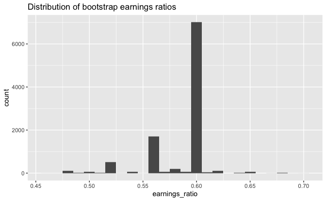

Regression and Other Stories: Earnings
================
Andrew Gelman, Jennifer Hill, Aki Vehtari
2020-12-20

-   [Data](#data)
-   [Plot](#plot)
-   [Standard deviation of bootstrap earnings
    ratios](#standard-deviation-of-bootstrap-earnings-ratios)

Tidyverse version by Bill Behrman.

Bootstrapping to simulate the sampling distribution. See Chapter 5 in
Regression and Other Stories.

------------------------------------------------------------------------

``` r
# Packages
library(tidyverse)

# Parameters
  # Earnings data
file_earnings <- here::here("Earnings/data/earnings.csv")
  # Common code
file_common <- here::here("_common.R")

#===============================================================================

# Run common code
source(file_common)
```

## Data

``` r
earnings <- 
  file_earnings %>% 
  read_csv() %>% 
  mutate(
    sex = 
      case_when(
        male == 0 ~ "female",
        male == 1 ~ "male",
        TRUE ~ NA_character_
      )
  )

earnings %>% 
  select(age, sex, earn)
```

    #> # A tibble: 1,816 x 3
    #>      age sex     earn
    #>    <dbl> <chr>  <dbl>
    #>  1    45 male   50000
    #>  2    58 female 60000
    #>  3    29 female 30000
    #>  4    57 female 25000
    #>  5    91 female 50000
    #>  6    54 female 62000
    #>  7    39 female 51000
    #>  8    26 female  9000
    #>  9    49 female 29000
    #> 10    46 male   32000
    #> # … with 1,806 more rows

Median of women’s earnings divided by the median of men’s earnings.

``` r
earnings %>% 
  summarize(
    earnings_ratio = median(earn[sex == "female"]) / median(earn[sex == "male"])
  ) %>% 
  pull(earnings_ratio)
```

    #> [1] 0.6

Earnings ratio of bootstrap sample. Since the function requires no
arguments, we use `...` in order to use `map_dbl()` below.

``` r
earnings_ratio <- function(...) {
  earnings %>% 
    select(sex, earn) %>% 
    slice_sample(prop = 1, replace = TRUE) %>% 
    summarize(
      earnings_ratio = 
        median(earn[sex == "female"]) / median(earn[sex == "male"])
    ) %>% 
    pull(earnings_ratio)
}
```

A set of bootstrap simulations.

``` r
set.seed(194)

n_sims <- 1e4

earnings_ratio_boot <- 
  tibble(earnings_ratio = map_dbl(seq_len(n_sims), earnings_ratio))
```

## Plot

``` r
earnings_ratio_boot %>% 
  ggplot(aes(earnings_ratio)) +
  geom_histogram(binwidth = 0.01) +
  labs(title = "Distribution of bootstrap earnings ratios")
```



``` r
earnings_ratio_boot %>% 
  count(earnings_ratio, sort = TRUE) %>% 
  mutate(prop_cum = cumsum(n) / sum(n))
```

    #> # A tibble: 48 x 3
    #>    earnings_ratio     n prop_cum
    #>             <dbl> <int>    <dbl>
    #>  1          0.6    6998    0.700
    #>  2          0.56   1698    0.870
    #>  3          0.52    508    0.920
    #>  4          0.580   151    0.936
    #>  5          0.48    109    0.946
    #>  6          0.625   102    0.957
    #>  7          0.59     66    0.963
    #>  8          0.5      56    0.969
    #>  9          0.652    52    0.974
    #> 10          0.570    49    0.979
    #> # … with 38 more rows

Because of the nature of the data, one value accounts for 70% of the
earnings ratios in the bootstrap samples and the top three account for
92%.

## Standard deviation of bootstrap earnings ratios

``` r
sd(earnings_ratio_boot$earnings_ratio)
```

    #> [1] 0.0271
