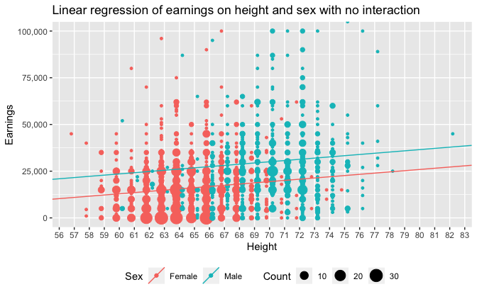
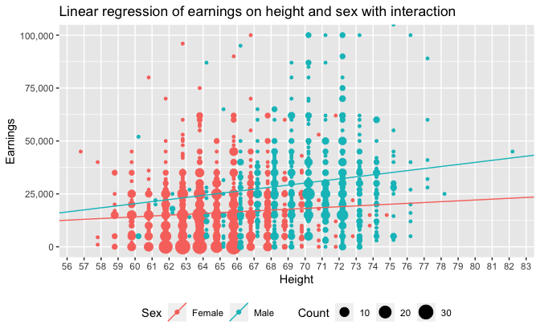

Regression and Other Stories: Earnings
================
Andrew Gelman, Jennifer Hill, Aki Vehtari
2020-12-22

-   [Chapter 6](#chapter-6)
    -   [Data](#data)
    -   [Linear regression of earnings on height and sex with no
        interaction](#linear-regression-of-earnings-on-height-and-sex-with-no-interaction)
    -   [Linear regression of earnings on height and sex with
        interaction](#linear-regression-of-earnings-on-height-and-sex-with-interaction)

Tidyverse version by Bill Behrman.

Predict respondents’ yearly earnings using survey data from 1990. See
Chapters 6, 9 and 12 in Regression and Other Stories.

------------------------------------------------------------------------

``` r
# Packages
library(tidyverse)
library(rstanarm)

# Parameters
  # Seed
SEED <- 7783
  # Earnings data
file_earnings <- here::here("Earnings/data/earnings.csv")
  # Common code
file_common <- here::here("_common.R")

#===============================================================================

# Run common code
source(file_common)
```

# Chapter 6

## Data

``` r
earnings <- 
  file_earnings %>% 
  read_csv() %>% 
  mutate(
    sex = 
      case_when(
        male == 0 ~ "female",
        male == 1 ~ "male",
        TRUE ~ NA_character_
      )
  )

earnings %>% 
  select(height, sex, earn)
```

    #> # A tibble: 1,816 x 3
    #>    height sex     earn
    #>     <dbl> <chr>  <dbl>
    #>  1     74 male   50000
    #>  2     66 female 60000
    #>  3     64 female 30000
    #>  4     65 female 25000
    #>  5     63 female 50000
    #>  6     68 female 62000
    #>  7     63 female 51000
    #>  8     64 female  9000
    #>  9     62 female 29000
    #> 10     73 male   32000
    #> # … with 1,806 more rows

## Linear regression of earnings on height and sex with no interaction

``` r
fit_2 <- 
  stan_glm(earn ~ height + sex, data = earnings, seed = SEED, refresh = 0)

print(fit_2)
```

    #> stan_glm
    #>  family:       gaussian [identity]
    #>  formula:      earn ~ height + sex
    #>  observations: 1816
    #>  predictors:   3
    #> ------
    #>             Median   MAD_SD  
    #> (Intercept) -26129.1  11683.7
    #> height         650.6    179.7
    #> sexmale      10630.6   1445.1
    #> 
    #> Auxiliary parameter(s):
    #>       Median  MAD_SD 
    #> sigma 21393.9   360.2
    #> 
    #> ------
    #> * For help interpreting the printed output see ?print.stanreg
    #> * For info on the priors used see ?prior_summary.stanreg

``` r
fit_params <- 
  tribble(
    ~sex, ~intercept, ~slope,
    "female", coef(fit_2)[["(Intercept)"]], coef(fit_2)[["height"]],
    "male", 
      coef(fit_2)[["(Intercept)"]] + coef(fit_2)[["sexmale"]],
      coef(fit_2)[["height"]]
  )

offset <- 0.2

earnings %>% 
  mutate(
    height =
      case_when(
        sex == "female" ~ height - offset,
        sex == "male" ~ height + offset,
        TRUE ~ NA_real_
      )
  ) %>% 
  ggplot(aes(height, earn, color = sex)) +
  geom_count() +
  geom_abline(
    aes(slope = slope, intercept = intercept, color = sex),
    data = fit_params
  ) +
  coord_cartesian(ylim = c(0, 1e5)) +
  scale_x_continuous(breaks = scales::breaks_width(1), minor_breaks = NULL) +
  scale_y_continuous(labels = scales::label_comma()) +
  scale_color_discrete(labels = c("Female", "Male")) +
  theme(legend.position = "bottom") +
  labs(
    title = 
      "Linear regression of earnings on height and sex with no interaction",
    x = "Height",
    y = "Earnings",
    color = "Sex",
    size = "Count"
  )
```



The equations for the regression lines are:

    Men:   y = -15499 + 651 x
    Women: y = -26129 + 651 x

## Linear regression of earnings on height and sex with interaction

``` r
fit_3 <- 
  stan_glm(
    earn ~ height + sex + height:sex,
    data = earnings,
    seed = SEED,
    refresh = 0
  )

print(fit_3)
```

    #> stan_glm
    #>  family:       gaussian [identity]
    #>  formula:      earn ~ height + sex + height:sex
    #>  observations: 1816
    #>  predictors:   4
    #> ------
    #>                Median   MAD_SD  
    #> (Intercept)     -9779.4  15218.0
    #> height            399.0    234.7
    #> sexmale        -28439.8  23449.0
    #> height:sexmale    577.6    345.4
    #> 
    #> Auxiliary parameter(s):
    #>       Median  MAD_SD 
    #> sigma 21401.5   351.6
    #> 
    #> ------
    #> * For help interpreting the printed output see ?print.stanreg
    #> * For info on the priors used see ?prior_summary.stanreg

``` r
fit_params <- 
  tribble(
    ~sex, ~intercept, ~slope,
    "female", coef(fit_3)[["(Intercept)"]], coef(fit_3)[["height"]],
    "male", 
      coef(fit_3)[["(Intercept)"]] + coef(fit_3)[["sexmale"]],
      coef(fit_3)[["height"]] + coef(fit_3)[["height:sexmale"]]
  )

offset <- 0.2

earnings %>% 
  mutate(
    height =
      case_when(
        sex == "female" ~ height - offset,
        sex == "male" ~ height + offset,
        TRUE ~ NA_real_
      )
  ) %>% 
  ggplot(aes(height, earn, color = sex)) +
  geom_count() +
  geom_abline(aes(slope = slope, intercept = intercept, color = sex), data = fit_params) +
  coord_cartesian(ylim = c(0, 1e5)) +
  scale_x_continuous(breaks = scales::breaks_width(1), minor_breaks = NULL) +
  scale_y_continuous(labels = scales::label_comma()) +
  scale_color_discrete(labels = c("Female", "Male")) +
  theme(legend.position = "bottom") +
  labs(
    title = 
      "Linear regression of earnings on height and sex with interaction",
    x = "Height",
    y = "Earnings",
    color = "Sex",
    size = "Count"
  )
```



The equations for the regression lines are:

    Men:   y = -38219 + 977 x
    Women: y =  -9779 + 399 x

From the plots, we can see that many more women than men have no
earnings.

``` r
earnings %>% 
  count(earn, sex) %>% 
  group_by(sex) %>% 
  mutate(prop = n / sum(n)) %>% 
  ungroup() %>% 
  filter(earn == 0)
```

    #> # A tibble: 2 x 4
    #>    earn sex        n   prop
    #>   <dbl> <chr>  <int>  <dbl>
    #> 1     0 female   172 0.151 
    #> 2     0 male      15 0.0222

15% of women have no earnings, whereas only 2% of men have no earnings.
