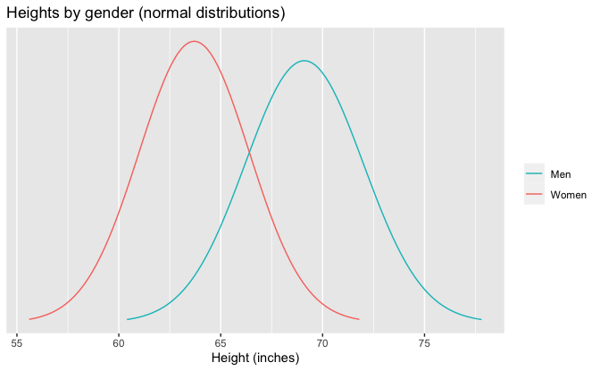
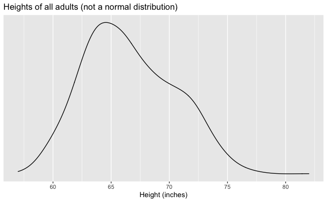

Regression and Other Stories: Height and Weight
================
Andrew Gelman, Jennifer Hill, Aki Vehtari
2020-12-09

-   [Chapter 3](#chapter-3)
    -   [Data](#data)
    -   [Plots](#plots)

Tidyverse version by Bill Behrman.

Predict weight from height. See Chapters 3, 9 and 10 in Regression and
Other Stories.

------------------------------------------------------------------------

``` r
# Packages
library(tidyverse)

# Parameters
  # Earnings and demographic data
file_earnings <- here::here("Earnings/data/earnings.csv")
  # Common code
file_common <- here::here("_common.R")

#===============================================================================

# Run common code
source(file_common)
```

# Chapter 3

## Data

``` r
earnings <- read_csv(file_earnings)

glimpse(earnings)
```

    #> Rows: 1,816
    #> Columns: 15
    #> $ height           <dbl> 74, 66, 64, 65, 63, 68, 63, 64, 62, 73, 72, 72, 72, …
    #> $ weight           <dbl> 210, 125, 126, 200, 110, 165, 190, 125, 200, 230, 17…
    #> $ male             <dbl> 1, 0, 0, 0, 0, 0, 0, 0, 0, 1, 1, 1, 1, 1, 0, 1, 1, 1…
    #> $ earn             <dbl> 50000, 60000, 30000, 25000, 50000, 62000, 51000, 900…
    #> $ earnk            <dbl> 50.00, 60.00, 30.00, 25.00, 50.00, 62.00, 51.00, 9.0…
    #> $ ethnicity        <chr> "White", "White", "White", "White", "Other", "Black"…
    #> $ education        <dbl> 16, 16, 16, 17, 16, 18, 17, 15, 12, 17, 15, NA, 12, …
    #> $ mother_education <dbl> 16, 16, 16, 17, 16, 18, 17, 15, 12, 17, 15, 99, 12, …
    #> $ father_education <dbl> 16, 16, 16, NA, 16, 18, 17, 15, 12, 17, 15, 99, 12, …
    #> $ walk             <dbl> 3, 6, 8, 8, 5, 1, 3, 7, 2, 7, 8, 1, 1, 4, 7, 7, 6, 4…
    #> $ exercise         <dbl> 3, 5, 1, 1, 6, 1, 1, 4, 2, 1, 1, 1, 2, 1, 4, 4, 5, 6…
    #> $ smokenow         <dbl> 2, 1, 2, 2, 2, 2, 2, 1, 2, 1, 2, 2, 2, 2, 2, 2, 2, 2…
    #> $ tense            <dbl> 0, 0, 1, 0, 0, 2, 4, 4, 0, 0, 0, 0, 1, 0, 2, 0, 2, 0…
    #> $ angry            <dbl> 0, 0, 1, 0, 0, 2, 4, 4, 0, 0, 0, 0, 1, 0, 2, 0, 2, 0…
    #> $ age              <dbl> 45, 58, 29, 57, 91, 54, 39, 26, 49, 46, 21, 53, 26, …

## Plots

``` r
height_men_mean <- 69.1
height_men_sd <- 2.9
height_women_mean <- 63.7
height_women_sd <- 2.7
n_points <- 101

v <- 
  tibble(
    sex = "Men",
    x = 
      seq(
        height_men_mean - 3 * height_men_sd,
        height_men_mean + 3 * height_men_sd,
        length.out = n_points
      ),
    y = dnorm(x, mean = height_men_mean, sd = height_men_sd)
  ) %>% 
  bind_rows(
    tibble(
      sex = "Women",
      x = 
        seq(
          height_women_mean - 3 * height_women_sd,
          height_women_mean + 3 * height_women_sd,
          length.out = n_points
        ),
      y = dnorm(x, mean = height_women_mean, sd = height_women_sd)
    )
  )

v %>% 
  ggplot(aes(x, y, color = sex)) +
  geom_line() +
  scale_y_continuous(breaks = NULL) +
  scale_color_discrete(direction = -1) +
  labs(
    title = "Heights by gender (normal distributions)",
    x = "Height (inches)",
    y = NULL,
    color = NULL
  )
```



``` r
earnings %>% 
  ggplot(aes(height)) +
  geom_density(adjust = 1.5) +
  scale_y_continuous(breaks = NULL) +
  labs(
    title = "Heights of all adults (not a normal distribution)",
    x = "Height (inches)",
    y = NULL
  )
```


