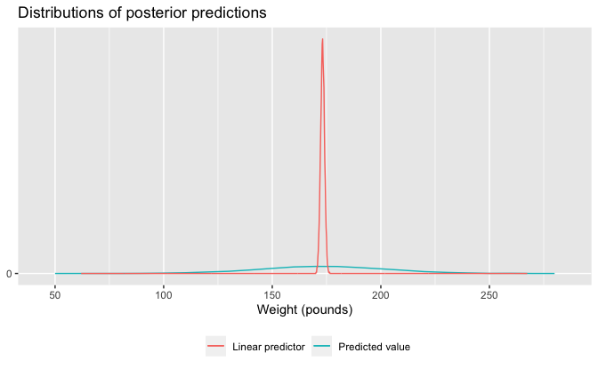

Regression and Other Stories: Height and weight
================
Andrew Gelman, Jennifer Hill, Aki Vehtari
2021-01-08

-   [Chapter 9](#chapter-9)
    -   [Data](#data)
    -   [Simulating uncertainty for the linear predictor and new
        observations](#simulating-uncertainty-for-the-linear-predictor-and-new-observations)
        -   [Plot](#plot)

Tidyverse version by Bill Behrman.

Predict weight from height. See Chapters 9 and 10 in Regression and
Other Stories.

------------------------------------------------------------------------

``` r
# Packages
library(tidyverse)
library(rstanarm)

# Parameters
  # Earnings data
file_earnings <- here::here("Earnings/data/earnings.csv")
  # Common code
file_common <- here::here("_common.R")

#===============================================================================

# Run common code
source(file_common)
```

# Chapter 9

## Data

``` r
earnings <- 
  file_earnings %>% 
  read_csv() %>% 
  mutate(
    sex = 
      case_when(
        male == 0 ~ "Female",
        male == 1 ~ "Male",
        TRUE ~ NA_character_
      )
  )

earnings %>% 
  select(height, weight, sex, ethnicity)
```

    #> # A tibble: 1,816 x 4
    #>    height weight sex    ethnicity
    #>     <dbl>  <dbl> <chr>  <chr>    
    #>  1     74    210 Male   White    
    #>  2     66    125 Female White    
    #>  3     64    126 Female White    
    #>  4     65    200 Female White    
    #>  5     63    110 Female Other    
    #>  6     68    165 Female Black    
    #>  7     63    190 Female White    
    #>  8     64    125 Female White    
    #>  9     62    200 Female White    
    #> 10     73    230 Male   White    
    #> # … with 1,806 more rows

``` r
mean(earnings$height)
```

    #> [1] 66.6

## Simulating uncertainty for the linear predictor and new observations

Fit linear regression of weight against height.

The option `refresh = 0` suppresses the default Stan sampling progress
output. This is useful for small data with fast computation. For more
complex models and bigger data, it can be useful to see the progress.

``` r
set.seed(733)

fit_1 <- stan_glm(weight ~ height, data = earnings, refresh = 0)

fit_1
```

    #> stan_glm
    #>  family:       gaussian [identity]
    #>  formula:      weight ~ height
    #>  observations: 1789
    #>  predictors:   2
    #> ------
    #>             Median MAD_SD
    #> (Intercept) -173.4   12.3
    #> height         4.9    0.2
    #> 
    #> Auxiliary parameter(s):
    #>       Median MAD_SD
    #> sigma 29.0    0.5  
    #> 
    #> ------
    #> * For help interpreting the printed output see ?print.stanreg
    #> * For info on the priors used see ?prior_summary.stanreg

Predict the weight for someone 66 inches tall.

``` r
set.seed(733)

pred_66 <- posterior_predict(fit_1, newdata = tibble(height = 66))
```

``` r
cat(
  str_glue(
    "The predicted weight for someone 66 inches tall is ",
    "{format(mean(pred_66), digits = 1, nsmall = 1)} pounds with a sd of ",
    "{format(sd(pred_66), digits = 1, nsmall = 1)}."
  )
)
```

    #> The predicted weight for someone 66 inches tall is 153.2 pounds with a sd of 29.0.

Center heights.

``` r
earnings <- 
  earnings %>% 
  mutate(c_height = height - 66)
```

Fit using centered heights.

``` r
set.seed(733)

fit_2 <- stan_glm(weight ~ c_height, data = earnings, refresh = 0)

fit_2
```

    #> stan_glm
    #>  family:       gaussian [identity]
    #>  formula:      weight ~ c_height
    #>  observations: 1789
    #>  predictors:   2
    #> ------
    #>             Median MAD_SD
    #> (Intercept) 153.4    0.7 
    #> c_height      4.9    0.2 
    #> 
    #> Auxiliary parameter(s):
    #>       Median MAD_SD
    #> sigma 29.0    0.5  
    #> 
    #> ------
    #> * For help interpreting the printed output see ?print.stanreg
    #> * For info on the priors used see ?prior_summary.stanreg

New data for someone 70 inches tall.

``` r
new <- tibble(c_height = 4)
```

Point prediction.

``` r
point_pred <- predict(fit_2, newdata = new)

as.double(point_pred)
```

    #> [1] 173

Posterior simulations where variation is from posterior uncertainty in
the coefficients.

``` r
linpred <- posterior_linpred(fit_2, newdata = new)
```

Posterior simulations where variation is from posterior uncertainty in
the coefficients and predictive uncertainty.

``` r
set.seed(733)

pred <- posterior_predict(fit_2, newdata = new)
```

``` r
preds <- tibble(linpred = as.double(linpred), pred = as.double(pred))

preds %>% 
  summarize(across(everything(), list(median = median, mad = mad)))
```

    #> # A tibble: 1 x 4
    #>   linpred_median linpred_mad pred_median pred_mad
    #>            <dbl>       <dbl>       <dbl>    <dbl>
    #> 1           173.       0.915        173.     28.3

The medians of the two sets of posterior simulations are similar, but
the median absolute deviations are very different.

### Plot

``` r
preds %>% 
  ggplot(aes(y = stat(density))) +
  geom_freqpoly(aes(linpred, color = "linpred"), binwidth = 0.2) +
  geom_freqpoly(aes(pred, color = "pred"), binwidth = 10) +
  scale_x_continuous(breaks = scales::breaks_width(50)) +
  scale_y_continuous(breaks = 0) +
  scale_color_discrete(
    labels = c("Linear predictor", "Predicted value")
  ) +
  theme(legend.position = "bottom") +
  labs(
    title = "Distributions of posterior predictions",
    x = "Weight (pounds)",
    y = NULL,
    color = NULL
  )
```


