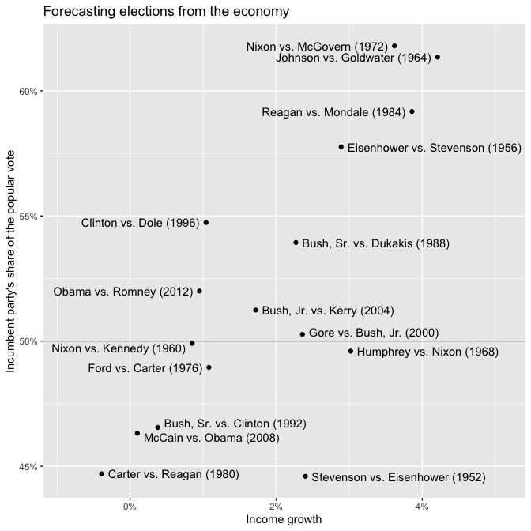
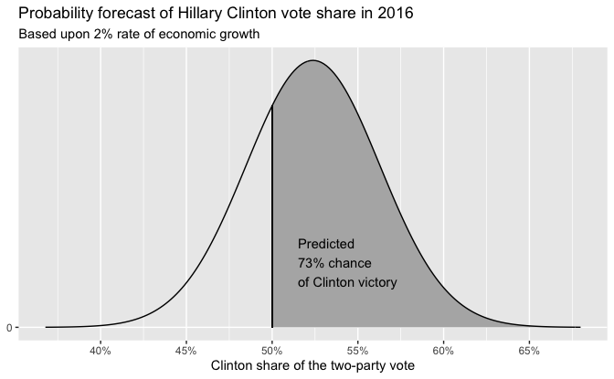

Regression and Other Stories: Elections Economy
================
Andrew Gelman, Jennifer Hill, Aki Vehtari
2020-12-25

-   [Chapter 1](#chapter-1)
    -   [Data](#data)
    -   [Graphing the bread and peace
        model](#graphing-the-bread-and-peace-model)
    -   [Linear regression](#linear-regression)
        -   [Posterior interval](#posterior-interval)
        -   [Plot regression line](#plot-regression-line)
-   [Chapter 7](#chapter-7)
    -   [Plot of economy and election
        results](#plot-of-economy-and-election-results)
    -   [Plot of prediction given 2%
        growth](#plot-of-prediction-given-2-growth)

Tidyverse version by Bill Behrman.

Predicting presidential vote share from the economy. See Chapters 1, 7,
8, 9, and 22 in Regression and Other Stories.

------------------------------------------------------------------------

``` r
# Packages
library(tidyverse)
library(rstanarm)

# Parameters
  # U.S. Presidential election results and GDP growth
file_hibbs <- here::here("ElectionsEconomy/data/hibbs.dat")
  # Common code
file_common <- here::here("_common.R")
  
#===============================================================================

# Run common code
source(file_common)
```

# Chapter 1

## Data

``` r
hibbs <- 
  file_hibbs %>% 
  read.table(header = TRUE) %>% 
  as_tibble()

hibbs
```

    #> # A tibble: 16 x 5
    #>     year growth  vote inc_party_candidate other_candidate
    #>    <int>  <dbl> <dbl> <chr>               <chr>          
    #>  1  1952   2.4   44.6 Stevenson           Eisenhower     
    #>  2  1956   2.89  57.8 Eisenhower          Stevenson      
    #>  3  1960   0.85  49.9 Nixon               Kennedy        
    #>  4  1964   4.21  61.3 Johnson             Goldwater      
    #>  5  1968   3.02  49.6 Humphrey            Nixon          
    #>  6  1972   3.62  61.8 Nixon               McGovern       
    #>  7  1976   1.08  49.0 Ford                Carter         
    #>  8  1980  -0.39  44.7 Carter              Reagan         
    #>  9  1984   3.86  59.2 Reagan              Mondale        
    #> 10  1988   2.27  53.9 Bush, Sr.           Dukakis        
    #> # … with 6 more rows

## Graphing the bread and peace model

``` r
hibbs %>% 
  ggplot(aes(growth, vote)) +
  geom_hline(yintercept = 50, color = "grey60") +
  geom_text(aes(label = year)) +
  scale_x_continuous(labels = scales::label_percent(accuracy = 1, scale = 1)) +
  scale_y_continuous(labels = scales::label_percent(accuracy = 1, scale = 1)) +
  labs(
    title = "Forecasting the election from the economy",
    x = "Average recent growth in personal income",
    y = "Incumbent party's vote share"
  )
```


## Linear regression

The option `refresh = 0` suppresses the default Stan sampling progress
output. This is useful for small data with fast computation. For more
complex models and bigger data, it can be useful to see the progress.

``` r
set.seed(264)

model <- stan_glm(vote ~ growth, data = hibbs, refresh = 0)
```

Print default summary of the fitted model.

``` r
model
```

    #> stan_glm
    #>  family:       gaussian [identity]
    #>  formula:      vote ~ growth
    #>  observations: 16
    #>  predictors:   2
    #> ------
    #>             Median MAD_SD
    #> (Intercept) 46.3    1.7  
    #> growth       3.1    0.7  
    #> 
    #> Auxiliary parameter(s):
    #>       Median MAD_SD
    #> sigma 3.9    0.7   
    #> 
    #> ------
    #> * For help interpreting the printed output see ?print.stanreg
    #> * For info on the priors used see ?prior_summary.stanreg

Print summary of the priors used.

``` r
prior_summary(model)
```

    #> Priors for model 'model' 
    #> ------
    #> Intercept (after predictors centered)
    #>   Specified prior:
    #>     ~ normal(location = 52, scale = 2.5)
    #>   Adjusted prior:
    #>     ~ normal(location = 52, scale = 14)
    #> 
    #> Coefficients
    #>   Specified prior:
    #>     ~ normal(location = 0, scale = 2.5)
    #>   Adjusted prior:
    #>     ~ normal(location = 0, scale = 10)
    #> 
    #> Auxiliary (sigma)
    #>   Specified prior:
    #>     ~ exponential(rate = 1)
    #>   Adjusted prior:
    #>     ~ exponential(rate = 0.18)
    #> ------
    #> See help('prior_summary.stanreg') for more details

Almost all models in Regression and Other Stories have very good
sampling behavior. `summary()` function can be used to obtain the
summary of the convergence diagnostics for MCMC sampling.

``` r
summary(model)
```

    #> 
    #> Model Info:
    #>  function:     stan_glm
    #>  family:       gaussian [identity]
    #>  formula:      vote ~ growth
    #>  algorithm:    sampling
    #>  sample:       4000 (posterior sample size)
    #>  priors:       see help('prior_summary')
    #>  observations: 16
    #>  predictors:   2
    #> 
    #> Estimates:
    #>               mean   sd   10%   50%   90%
    #> (Intercept) 46.3    1.8 44.1  46.3  48.5 
    #> growth       3.0    0.8  2.1   3.1   4.0 
    #> sigma        4.0    0.8  3.1   3.9   5.1 
    #> 
    #> Fit Diagnostics:
    #>            mean   sd   10%   50%   90%
    #> mean_PPD 52.1    1.5 50.2  52.1  53.9 
    #> 
    #> The mean_ppd is the sample average posterior predictive distribution of the outcome variable (for details see help('summary.stanreg')).
    #> 
    #> MCMC diagnostics
    #>               mcse Rhat n_eff
    #> (Intercept)   0.0  1.0  3056 
    #> growth        0.0  1.0  3162 
    #> sigma         0.0  1.0  2352 
    #> mean_PPD      0.0  1.0  3299 
    #> log-posterior 0.0  1.0  1256 
    #> 
    #> For each parameter, mcse is Monte Carlo standard error, n_eff is a crude measure of effective sample size, and Rhat is the potential scale reduction factor on split chains (at convergence Rhat=1).

### Posterior interval

``` r
posterior_interval(model) %>% 
  round(digits = 1)
```

    #>               5%  95%
    #> (Intercept) 43.5 49.1
    #> growth       1.8  4.3
    #> sigma        3.0  5.5

### Plot regression line

``` r
intercept <- coef(model)[["(Intercept)"]]
slope <- coef(model)[["growth"]]
eqn <- 
  str_glue(
    "y = {format(intercept, digits = 1, nsmall = 1)} + ",
    "{format(slope, digits = 1, nsmall = 1)} x"
  )

hibbs %>% 
  ggplot(aes(growth, vote)) +
  geom_hline(yintercept = 50, color = "grey60") +
  geom_abline(slope = slope, intercept = intercept) +
  geom_point() +
  annotate("text", x = 3, y = 54, label = eqn, hjust = 0) +
  scale_x_continuous(labels = scales::label_percent(accuracy = 1, scale = 1)) +
  scale_y_continuous(labels = scales::label_percent(accuracy = 1, scale = 1)) +
  labs(
    title = "Data and linear fit",
    x = "Average recent growth in personal income",
    y = "Incumbent party's vote share"
  )
```


# Chapter 7

## Plot of economy and election results

``` r
v <- 
  hibbs %>% 
  mutate(
    label = str_glue("  {inc_party_candidate} vs. {other_candidate} ({year})  "),
    hjust = 
      if_else(
        year %in% c(1960, 1964, 1972, 1976, 1984, 1996, 2012),
        "right",
        "left"
      ),
    vjust =
      case_when(
        year == 1992 ~ 0,
        year == 2000 ~ 0.2,
        year %in% c(1960, 2008) ~ 1,
        TRUE ~ 0.5
      )
  )

v %>% 
  ggplot(aes(growth, vote)) +
  geom_hline(yintercept = 50, color = "grey60") +
  geom_point() +
  geom_text(aes(label = label, hjust = hjust, vjust = vjust)) +
  scale_x_continuous(
    labels = scales::label_percent(accuracy = 1, scale = 1),
    expand = expansion(add = c(0.8, 1.2))
  ) +
  scale_y_continuous(labels = scales::label_percent(accuracy = 1, scale = 1)) +
  labs(
    title = "Forecasting elections from the economy",
    x = "Income growth",
    y = "Incumbent party's share of the popular vote"
  )
```



``` r
growth <- 2
```

## Plot of prediction given 2% growth

``` r
vote_pred <- predict(model, newdata = tibble(growth = growth))
sd <- sigma(model)

v <- 
  tibble(
    vote = c(50, seq(vote_pred - 4 * sd, vote_pred + 4 * sd, length.out = 201)),
    y = dnorm(vote, mean = vote_pred, sd = sd)
  )

label <-
  str_glue(
    "Predicted\n",
    "{format(100 * (1 - pnorm(50, mean = vote_pred, sd = sd)), digits = 0)}% ",
    "chance\n",
    "of Clinton victory"
  )

v %>% 
  ggplot(aes(vote, y)) +
  geom_area(data = . %>% filter(vote >= 50), fill = "grey70") +
  geom_line() +
  geom_segment(
    aes(x = 50, xend = 50, y = 0, yend = dnorm(50, mean = vote_pred, sd = sd))
  ) +
  annotate("text", x = 51.5, y = 0.025, label = label, hjust = 0) +
  scale_x_continuous(
    breaks = scales::breaks_width(5),
    labels = scales::label_percent(accuracy = 1, scale = 1)
  ) +
  scale_y_continuous(breaks = 0) +
  labs(
    title = "Probability forecast of Hillary Clinton vote share in 2016",
    subtitle = str_glue("Based upon {growth}% rate of economic growth"),
    x = "Clinton share of the two-party vote",
    y = NULL
  )
```


