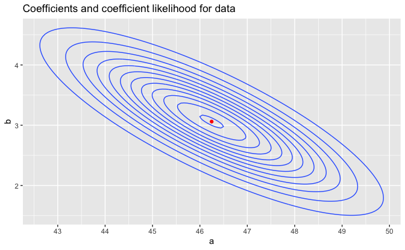
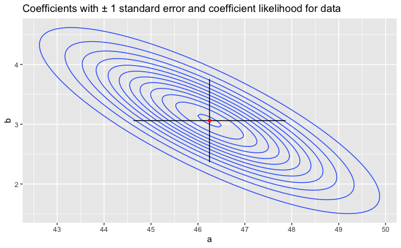
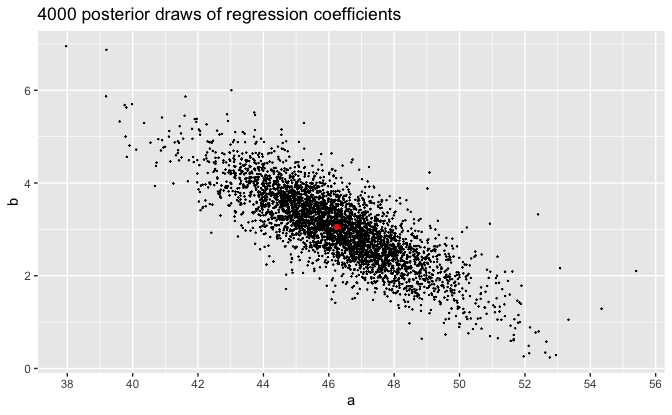

Regression and Other Stories: Elections Economy
================
Andrew Gelman, Jennifer Hill, Aki Vehtari
2021-01-04

-   [Data](#data)
-   [Classical least squares linear
    regression](#classical-least-squares-linear-regression)
-   [Bayesian model with flat priors](#bayesian-model-with-flat-priors)
    -   [With estimation based upon
        optimization](#with-estimation-based-upon-optimization)
    -   [With estimation based upon
        sampling (MCMC)](#with-estimation-based-upon-sampling-mcmc)

Tidyverse version by Bill Behrman.

Present uncertainty in parameter estimates. See Chapter 8 in Regression
and Other Stories.

------------------------------------------------------------------------

``` r
# Packages
library(tidyverse)
library(arm)
library(rstanarm)

# Parameters
  # U.S. Presidential election results and GDP growth
file_hibbs <- here::here("ElectionsEconomy/data/hibbs.dat")
  # Common code
file_common <- here::here("_common.R")
  
#===============================================================================

# Run common code
source(file_common)
```

## Data

``` r
hibbs <- 
  file_hibbs %>% 
  read.table(header = TRUE) %>% 
  as_tibble()

hibbs
```

    #> # A tibble: 16 x 5
    #>     year growth  vote inc_party_candidate other_candidate
    #>    <int>  <dbl> <dbl> <chr>               <chr>          
    #>  1  1952   2.4   44.6 Stevenson           Eisenhower     
    #>  2  1956   2.89  57.8 Eisenhower          Stevenson      
    #>  3  1960   0.85  49.9 Nixon               Kennedy        
    #>  4  1964   4.21  61.3 Johnson             Goldwater      
    #>  5  1968   3.02  49.6 Humphrey            Nixon          
    #>  6  1972   3.62  61.8 Nixon               McGovern       
    #>  7  1976   1.08  49.0 Ford                Carter         
    #>  8  1980  -0.39  44.7 Carter              Reagan         
    #>  9  1984   3.86  59.2 Reagan              Mondale        
    #> 10  1988   2.27  53.9 Bush, Sr.           Dukakis        
    #> # … with 6 more rows

## Classical least squares linear regression

``` r
fit_1 <- lm(vote ~ growth, data = hibbs)

display(fit_1)
```

    #> lm(formula = vote ~ growth, data = hibbs)
    #>             coef.est coef.se
    #> (Intercept) 46.25     1.62  
    #> growth       3.06     0.70  
    #> ---
    #> n = 16, k = 2
    #> residual sd = 3.76, R-Squared = 0.58

The linear regression coefficients returned by `lm()` are at the maximum
of a multivariate normal likelihood function.

``` r
coef_1 <- coef(fit_1)
a_1 <- coef_1[["(Intercept)"]]
b_1 <- coef_1[["growth"]]
vcov_1 <- vcov(fit_1)
a_1_se <- sqrt(diag(vcov_1))[["(Intercept)"]]
b_1_se <- sqrt(diag(vcov_1))[["growth"]]
n_points <- 201

v <- 
  expand_grid(
    a = seq(a_1 - 4 * a_1_se, a_1 + 4 * a_1_se, length.out = n_points),
    b = seq(b_1 - 4 * b_1_se, b_1 + 4 * b_1_se, length.out = n_points)
  ) %>% 
  mutate(
    prob = mvtnorm::dmvnorm(x = as.matrix(.), mean = coef_1, sigma = vcov_1)
  )

v %>% 
  ggplot(aes(a, b)) +
  geom_contour(aes(z = prob)) +
  geom_point(data = tibble(a = a_1, b = b_1), color = "red") +
  scale_x_continuous(breaks = scales::breaks_width(1)) +
  labs(title = "Coefficients and coefficient likelihood for data")
```



``` r
v %>% 
  ggplot(aes(a, b)) +
  geom_contour(aes(z = prob)) +
  annotate(
    "segment",
    x    = c(a_1 - a_1_se, a_1),
    xend = c(a_1 + a_1_se, a_1),
    y    = c(b_1, b_1 - b_1_se),
    yend = c(b_1, b_1 + b_1_se)
  ) +
  geom_point(data = tibble(a = a_1, b = b_1), color = "red") +
  scale_x_continuous(breaks = scales::breaks_width(1)) +
  labs(
    title =
      "Coefficients with ± 1 standard error and coefficient likelihood for data"
  )
```



## Bayesian model with flat priors

### With estimation based upon optimization

A Bayesian model using flat priors will result in a posterior
distribution that is the same as the likelihood function for classical
least squares regression. If we direct the algorithm to perform
optimization instead of sampling, it will seek the same maximum
likelihood estimate that is returned by classical least squares
regression.

``` r
set.seed(466)

fit_2 <- 
  stan_glm(
    vote ~ growth,
    data = hibbs,
    refresh = 0,
    prior = NULL,
    prior_intercept = NULL,
    prior_aux = NULL,
    algorithm = "optimizing"
  )
```

``` r
coef_2 <- coef(fit_2)

coef_2 - coef_1
```

    #> (Intercept)      growth 
    #>    -0.00298     0.02453

The coefficients obtained through optimizing are close to the least
square coefficients.

### With estimation based upon sampling (MCMC)

``` r
set.seed(466)

fit_3 <- 
  stan_glm(
    vote ~ growth,
    data = hibbs,
    refresh = 0,
    prior = NULL,
    prior_intercept = NULL,
    prior_aux = NULL,
    algorithm = "sampling"
  )
```

``` r
coef_3 <- coef(fit_3)

coef_3 - coef_1
```

    #> (Intercept)      growth 
    #>    -0.00542    -0.00782

The coefficients obtained by sampling are even closer to the least
square coefficients than those found through optimizing.

``` r
a_3 <- coef_3[["(Intercept)"]]
b_3 <- coef_3[["growth"]]

draws <- 
  as_tibble(fit_3) %>% 
  rename(a = "(Intercept)", b = "growth")

draws %>% 
  ggplot(aes(a, b)) +
  geom_point(size = 0.1) +
  geom_point(data = tibble(a = a_3, b = b_3), color = "red", size = 1.5) +
  scale_x_continuous(breaks = scales::breaks_width(2)) +
  labs(title = str_glue("{nrow(draws)} posterior draws of coefficients"))
```


