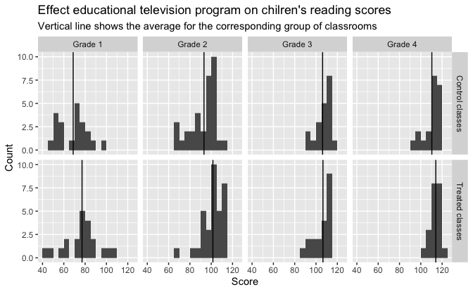

Regression and Other Stories: Electric Company
================
Andrew Gelman, Jennifer Hill, Aki Vehtari
2020-12-18

-   [Chapter 1](#chapter-1)
    -   [Data](#data)
    -   [Plot of raw data](#plot-of-raw-data)

Tidyverse version by Bill Behrman.

Analysis of “Electric company” data. See Chapters 1, 16, 19 and 20 in
Regression and Other Stories.

------------------------------------------------------------------------

``` r
# Packages
library(tidyverse)

# Parameters
  # U.S. Presidential election results and GDP growth
file_electric_wide <- here::here("ElectricCompany/data/electric_wide.txt")
  # Common code
file_common <- here::here("_common.R")

#===============================================================================

# Run common code
source(file_common)
```

# Chapter 1

## Data

``` r
electric_wide <- read_table2(file_electric_wide)

glimpse(electric_wide)
```

    #> Rows: 96
    #> Columns: 7
    #> $ city             <chr> "Fresno", "Fresno", "Fresno", "Fresno", "Fresno", "F…
    #> $ grade            <dbl> 1, 1, 1, 1, 1, 1, 1, 1, 1, 1, 1, 2, 2, 2, 2, 2, 2, 2…
    #> $ treated_pretest  <dbl> 13.8, 16.5, 18.5, 8.8, 15.3, 15.0, 19.4, 15.0, 11.8,…
    #> $ treated_posttest <dbl> 48.9, 70.5, 89.7, 44.2, 77.5, 84.7, 78.9, 86.8, 60.8…
    #> $ control_pretest  <dbl> 12.3, 14.4, 17.7, 11.5, 16.4, 16.8, 18.7, 18.2, 15.4…
    #> $ control_posttest <dbl> 52.3, 55.0, 80.4, 47.0, 69.7, 74.1, 72.7, 97.3, 74.1…
    #> $ supplement       <chr> "Supplement", "Replace", "Supplement", "Replace", "S…

``` r
electric <- 
  electric_wide %>% 
  pivot_longer(
    cols = matches("(control|treated)_(pretest|posttest)"),
    names_to = c("group", "test"),
    names_pattern = "(.*)_(.*)",
    values_to = "score"
  )

electric
```

    #> # A tibble: 384 x 6
    #>    city   grade supplement group   test     score
    #>    <chr>  <dbl> <chr>      <chr>   <chr>    <dbl>
    #>  1 Fresno     1 Supplement treated pretest   13.8
    #>  2 Fresno     1 Supplement treated posttest  48.9
    #>  3 Fresno     1 Supplement control pretest   12.3
    #>  4 Fresno     1 Supplement control posttest  52.3
    #>  5 Fresno     1 Replace    treated pretest   16.5
    #>  6 Fresno     1 Replace    treated posttest  70.5
    #>  7 Fresno     1 Replace    control pretest   14.4
    #>  8 Fresno     1 Replace    control posttest  55  
    #>  9 Fresno     1 Supplement treated pretest   18.5
    #> 10 Fresno     1 Supplement treated posttest  89.7
    #> # … with 374 more rows

## Plot of raw data

``` r
electric_post <- 
  electric %>% 
  filter(test == "posttest")

score_means <- 
  electric_post %>% 
  group_by(grade, group) %>% 
  summarize(score_mean = mean(score)) %>% 
  ungroup()

grade_labels <- function(x) str_glue("Grade {x}")
group_labels <- 
  c(
    control = "Control classes",
    treated = "Treated classes"
  )

electric_post %>% 
  ggplot(aes(score)) +
  geom_histogram(binwidth = 5, boundary = 0) +
  geom_vline(aes(xintercept = score_mean), data = score_means) +
  facet_grid(
    rows = vars(group),
    cols = vars(grade),
    labeller = labeller(grade = grade_labels, group = group_labels)
  ) + 
  labs(
    x = "Score",
    y = "Count"
  )
```


