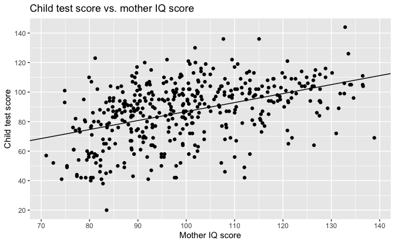
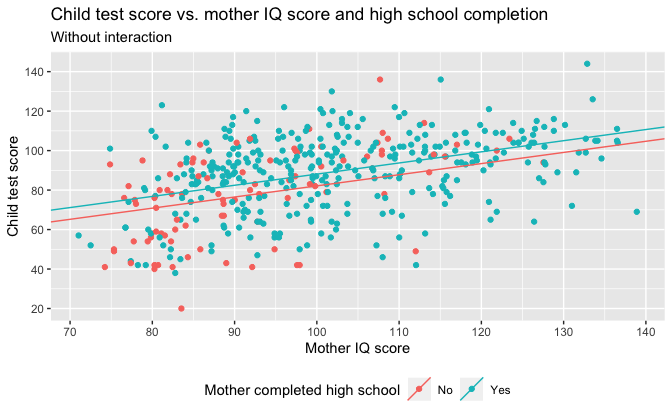
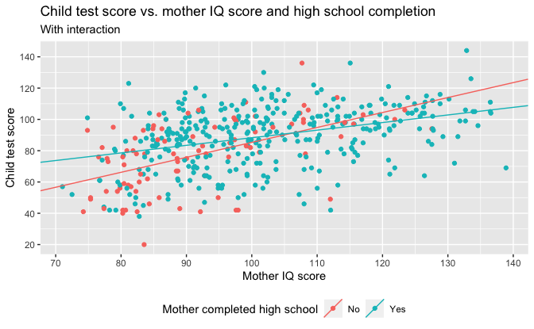
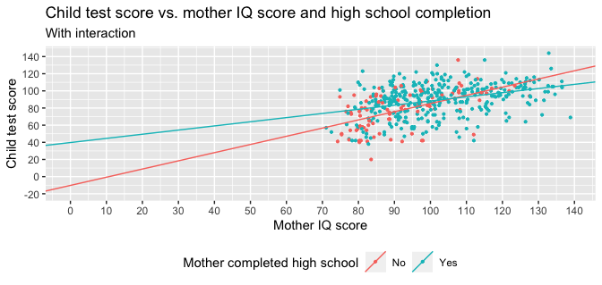

Regression and Other Stories: KidIQ
================
Andrew Gelman, Jennifer Hill, Aki Vehtari
2021-01-11

-   [Chapter 10](#chapter-10)
    -   [Data](#data)
    -   [Adding predictors to a model](#adding-predictors-to-a-model)
        -   [Starting with a binary
            predictor](#starting-with-a-binary-predictor)
        -   [A single continuous
            predictor](#a-single-continuous-predictor)
        -   [Including both predictors](#including-both-predictors)
    -   [Interactions](#interactions)

Tidyverse version by Bill Behrman.

Linear regression with multiple predictors. See Chapters 10, 11 and 12
in Regression and Other Stories.

------------------------------------------------------------------------

``` r
# Packages
library(tidyverse)
library(rstanarm)

# Parameters
  # Kid test score data
file_kids <- here::here("KidIQ/data/kidiq.csv")
  # Common code
file_common <- here::here("_common.R")

#===============================================================================

# Run common code
source(file_common)
```

# Chapter 10

## Data

``` r
kids <- read_csv(file_kids)

kids
```

    #> # A tibble: 434 x 5
    #>    kid_score mom_hs mom_iq mom_work mom_age
    #>        <dbl>  <dbl>  <dbl>    <dbl>   <dbl>
    #>  1        65      1  121.         4      27
    #>  2        98      1   89.4        4      25
    #>  3        85      1  115.         4      27
    #>  4        83      1   99.4        3      25
    #>  5       115      1   92.7        4      27
    #>  6        98      0  108.         1      18
    #>  7        69      1  139.         4      20
    #>  8       106      1  125.         3      23
    #>  9       102      1   81.6        1      24
    #> 10        95      1   95.1        1      19
    #> # … with 424 more rows

## Adding predictors to a model

### Starting with a binary predictor

The option `refresh = 0` suppresses the default Stan sampling progress
output. This is useful for small data with fast computation. For more
complex models and bigger data, it can be useful to see the progress.

``` r
set.seed(765)

fit_1 <- stan_glm(kid_score ~ mom_hs, data = kids, refresh = 0)

fit_1
```

    #> stan_glm
    #>  family:       gaussian [identity]
    #>  formula:      kid_score ~ mom_hs
    #>  observations: 434
    #>  predictors:   2
    #> ------
    #>             Median MAD_SD
    #> (Intercept) 77.5    2.1  
    #> mom_hs      11.8    2.3  
    #> 
    #> Auxiliary parameter(s):
    #>       Median MAD_SD
    #> sigma 19.9    0.7  
    #> 
    #> ------
    #> * For help interpreting the printed output see ?print.stanreg
    #> * For info on the priors used see ?prior_summary.stanreg

``` r
intercept <- coef(fit_1)[["(Intercept)"]]
slope <- coef(fit_1)[["mom_hs"]]

kids %>% 
  ggplot(aes(mom_hs, kid_score)) +
  geom_count() +
  geom_abline(slope = slope, intercept = intercept) +
  scale_x_continuous(
    breaks = 0:1,
    minor_breaks = NULL,
    labels = c("No", "Yes")
  ) +
  scale_y_continuous(breaks = scales::breaks_width(20)) +
  labs(
    title = "Child test score vs. mother high school completion",
    x = "Mother completed high school",
    y = "Child test score",
    size = "Count"
  )
```


### A single continuous predictor

``` r
set.seed(765)

fit_2 <- stan_glm(kid_score ~ mom_iq, data = kids, refresh = 0)

fit_2
```

    #> stan_glm
    #>  family:       gaussian [identity]
    #>  formula:      kid_score ~ mom_iq
    #>  observations: 434
    #>  predictors:   2
    #> ------
    #>             Median MAD_SD
    #> (Intercept) 25.9    6.1  
    #> mom_iq       0.6    0.1  
    #> 
    #> Auxiliary parameter(s):
    #>       Median MAD_SD
    #> sigma 18.3    0.6  
    #> 
    #> ------
    #> * For help interpreting the printed output see ?print.stanreg
    #> * For info on the priors used see ?prior_summary.stanreg

``` r
intercept <- coef(fit_2)[["(Intercept)"]]
slope <- coef(fit_2)[["mom_iq"]]

kids %>% 
  ggplot(aes(mom_iq, kid_score)) +
  geom_point() +
  geom_abline(slope = slope, intercept = intercept) +
  scale_x_continuous(breaks = scales::breaks_width(10)) +
  scale_y_continuous(breaks = scales::breaks_width(20)) +
  labs(
    title = "Child test score vs. mother IQ score",
    x = "Mother IQ score",
    y = "Child test score"
  )
```



### Including both predictors

``` r
set.seed(765)

fit_3 <- stan_glm(kid_score ~ mom_hs + mom_iq, data = kids, refresh = 0)

fit_3
```

    #> stan_glm
    #>  family:       gaussian [identity]
    #>  formula:      kid_score ~ mom_hs + mom_iq
    #>  observations: 434
    #>  predictors:   3
    #> ------
    #>             Median MAD_SD
    #> (Intercept) 25.6    5.9  
    #> mom_hs       6.0    2.2  
    #> mom_iq       0.6    0.1  
    #> 
    #> Auxiliary parameter(s):
    #>       Median MAD_SD
    #> sigma 18.1    0.6  
    #> 
    #> ------
    #> * For help interpreting the printed output see ?print.stanreg
    #> * For info on the priors used see ?prior_summary.stanreg

``` r
lines <- 
  tribble(
    ~mom_hs, ~intercept, ~slope,
    0, coef(fit_3)[["(Intercept)"]], coef(fit_3)[["mom_iq"]],
    1, 
      coef(fit_3)[["(Intercept)"]] + coef(fit_3)[["mom_hs"]],
      coef(fit_3)[["mom_iq"]]
  )

kids %>% 
  ggplot(aes(mom_iq, kid_score, color = factor(mom_hs))) +
  geom_point() +
  geom_abline(
    aes(slope = slope, intercept = intercept, color = factor(mom_hs)),
    data = lines
  ) +
  scale_x_continuous(breaks = scales::breaks_width(10)) +
  scale_y_continuous(breaks = scales::breaks_width(20)) +
  scale_color_discrete(breaks = 0:1, labels = c("No", "Yes")) +
  theme(legend.position = "bottom") +
  labs(
    title = "Child test score vs. mother IQ score and high school completion",
    subtitle = "Without interaction",
    x = "Mother IQ score",
    y = "Child test score",
    color = "Mother completed high school"
  )
```



## Interactions

``` r
set.seed(765)

fit_4 <- 
  stan_glm(
    kid_score ~ mom_hs + mom_iq + mom_hs:mom_iq,
    data = kids,
    refresh = 0
  )

fit_4
```

    #> stan_glm
    #>  family:       gaussian [identity]
    #>  formula:      kid_score ~ mom_hs + mom_iq + mom_hs:mom_iq
    #>  observations: 434
    #>  predictors:   4
    #> ------
    #>               Median MAD_SD
    #> (Intercept)   -10.2   14.4 
    #> mom_hs         50.0   15.8 
    #> mom_iq          1.0    0.2 
    #> mom_hs:mom_iq  -0.5    0.2 
    #> 
    #> Auxiliary parameter(s):
    #>       Median MAD_SD
    #> sigma 18.0    0.6  
    #> 
    #> ------
    #> * For help interpreting the printed output see ?print.stanreg
    #> * For info on the priors used see ?prior_summary.stanreg

``` r
lines <- 
  tribble(
    ~mom_hs, ~intercept, ~slope,
    0, coef(fit_4)[["(Intercept)"]], coef(fit_4)[["mom_iq"]],
    1, 
      coef(fit_4)[["(Intercept)"]] + coef(fit_4)[["mom_hs"]],
      coef(fit_4)[["mom_iq"]] + coef(fit_4)[["mom_hs:mom_iq"]]
  )

kids %>% 
  ggplot(aes(mom_iq, kid_score, color = factor(mom_hs))) +
  geom_point() +
  geom_abline(
    aes(slope = slope, intercept = intercept, color = factor(mom_hs)),
    data = lines
  ) +
  scale_x_continuous(breaks = scales::breaks_width(10)) +
  scale_y_continuous(breaks = scales::breaks_width(20)) +
  scale_color_discrete(breaks = 0:1, labels = c("No", "Yes")) +
  theme(legend.position = "bottom") +
  labs(
    title = "Child test score vs. mother IQ score and high school completion",
    subtitle = "With interaction",
    x = "Mother IQ score",
    y = "Child test score",
    color = "Mother completed high school"
  )
```



``` r
kids %>% 
  ggplot(aes(mom_iq, kid_score, color = factor(mom_hs))) +
  geom_point() +
  geom_abline(
    aes(slope = slope, intercept = intercept, color = factor(mom_hs)),
    data = lines
  ) +
  coord_cartesian(xlim = c(0, NA), ylim = c(-20, NA)) +
  scale_x_continuous(breaks = scales::breaks_width(10)) +
  scale_y_continuous(breaks = scales::breaks_width(20)) +
  scale_color_discrete(breaks = 0:1, labels = c("No", "Yes")) +
  theme(legend.position = "bottom") +
  labs(
    title = "Child test score vs. mother IQ score and high school completion",
    subtitle = "With interaction",
    x = "Mother IQ score",
    y = "Child test score",
    color = "Mother completed high school"
  )
```


