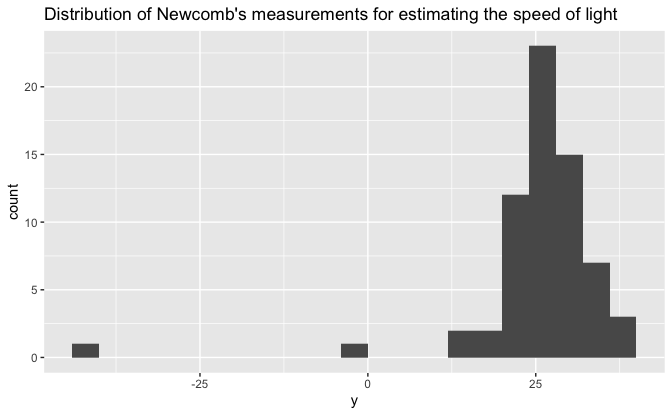
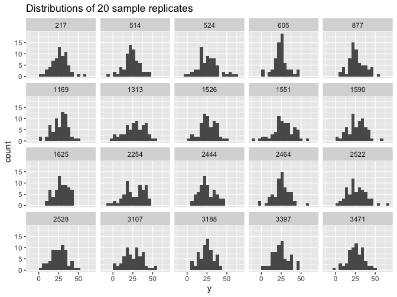
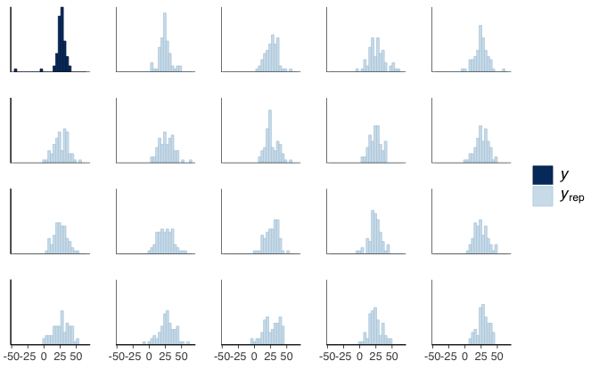
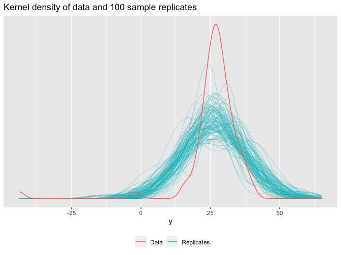
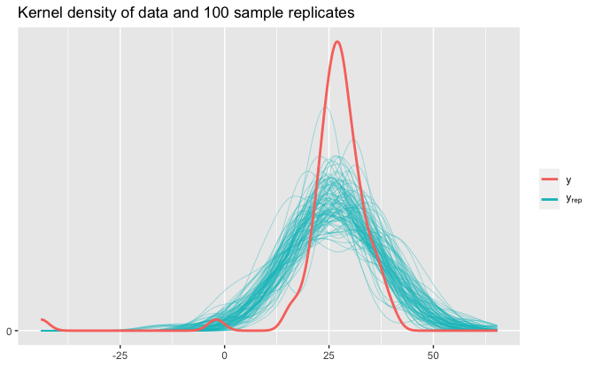
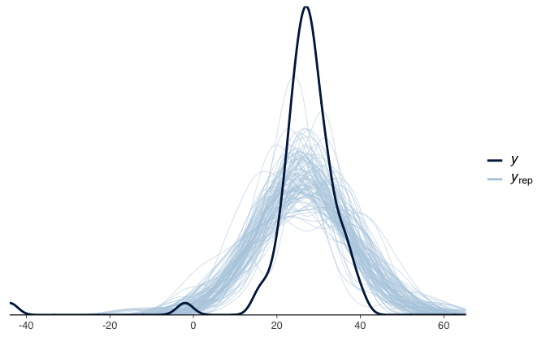
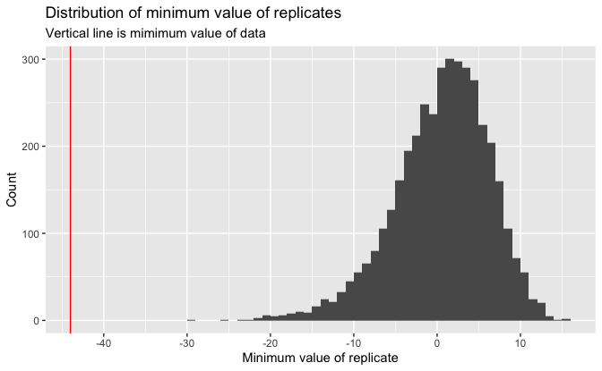

Regression and Other Stories: Newcomb
================
Andrew Gelman, Jennifer Hill, Aki Vehtari
2021-01-28

-   [Chapter 11](#chapter-11)
    -   [Comparing data to replications from a fitted
        model](#comparing-data-to-replications-from-a-fitted-model)
        -   [Example: simulation-based checking of a fitted normal
            distribution](#example-simulation-based-checking-of-a-fitted-normal-distribution)

Tidyverse version by Bill Behrman.

Posterior predictive checking of Normal model for Newcomb’s speed of
light data. See Chapter 11 in Regression and Other Stories.

------------------------------------------------------------------------

``` r
# Packages
library(tidyverse)
library(bayesplot)
library(rstanarm)

# Parameters
  # Simon Newcomb's measurements for estimating the speed of light (1882)
file_newcomb <- here::here("Newcomb/data/newcomb.txt")
  # Common code
file_common <- here::here("_common.R")

#===============================================================================

# Run common code
source(file_common)
```

# Chapter 11

## Comparing data to replications from a fitted model

### Example: simulation-based checking of a fitted normal distribution

Data.

``` r
newcomb <- read_table2(file_newcomb)

newcomb
```

    #> # A tibble: 66 x 1
    #>        y
    #>    <dbl>
    #>  1    28
    #>  2    26
    #>  3    33
    #>  4    24
    #>  5    34
    #>  6   -44
    #>  7    27
    #>  8    16
    #>  9    40
    #> 10    -2
    #> # … with 56 more rows

Histogram of data.

``` r
newcomb %>% 
  ggplot(aes(y)) +
  geom_histogram(binwidth = 4, boundary = 0) +
  labs(
    title = 
      "Distribution of Newcomb's measurements for estimating the speed of light"
  )
```



Fit a regression model with just the intercept term.

The option `refresh = 0` suppresses the default Stan sampling progress
output. This is useful for small data with fast computation. For more
complex models and bigger data, it can be useful to see the progress.

``` r
set.seed(264)

fit <- stan_glm(y ~ 1, data = newcomb, refresh = 0)

fit
```

    #> stan_glm
    #>  family:       gaussian [identity]
    #>  formula:      y ~ 1
    #>  observations: 66
    #>  predictors:   1
    #> ------
    #>             Median MAD_SD
    #> (Intercept) 26.2    1.3  
    #> 
    #> Auxiliary parameter(s):
    #>       Median MAD_SD
    #> sigma 10.8    0.9  
    #> 
    #> ------
    #> * For help interpreting the printed output see ?print.stanreg
    #> * For info on the priors used see ?prior_summary.stanreg

Simulate from the predictive distribution.

``` r
set.seed(970)

sims <- as_tibble(fit)

n_sims <- nrow(sims)
n_newcomb <- nrow(newcomb)

y_rep_sim <- 
  sims %>% 
  pmap_dfr(
    ~ tibble(y = rnorm(n_newcomb, mean = .x, sd = .y)),
    .id = "rep"
  ) %>% 
  mutate(rep = as.integer(rep))

y_rep_sim
```

    #> # A tibble: 264,000 x 2
    #>      rep     y
    #>    <int> <dbl>
    #>  1     1 30.5 
    #>  2     1 22.3 
    #>  3     1 18.1 
    #>  4     1 49.0 
    #>  5     1 20.3 
    #>  6     1  1.67
    #>  7     1 23.7 
    #>  8     1 52.8 
    #>  9     1  6.02
    #> 10     1 31.9 
    #> # … with 263,990 more rows

`y_rep_sim` is a tidy tibble with 4000 \* 66 rows.

Simulate using `posterior_predict()`.

``` r
set.seed(970)

y_rep <- posterior_predict(fit)

class(y_rep)
```

    #> [1] "ppd"    "matrix" "array"

``` r
dim(y_rep)
```

    #> [1] 4000   66

`y_rep` is a matrix with 4000 rows and 66 columns.

Compare `y_rep_sim` and `y_rep`.

``` r
v <- matrix(y_rep_sim$y, nrow = n_sims, ncol = n_newcomb, byrow = TRUE)

max(abs(y_rep - v))
```

    #> [1] 0

`y_rep_sim` and `y_rep` have the same replicate values.

#### Visual comparison of actual and replicated datasets

Plot histograms for 20 sample replicates.

``` r
set.seed(792)

y_rep_sim %>% 
  filter(rep %in% sample(n_sims, 20)) %>% 
  ggplot(aes(y)) + 
  geom_histogram(binwidth = 4, boundary = 0) +
  facet_wrap(vars(rep), ncol = 5) +
  labs(title = "Distributions of 20 sample replicates")
```



Plot histograms for data and 19 sample replicates using bayesplot.

``` r
set.seed(792)

ppc_hist(y = newcomb$y, yrep = y_rep[sample(n_sims, 19), ], binwidth = 4)
```



Plot kernel density of data and 100 sample replicates.

``` r
set.seed(792)

ggplot(mapping = aes(y)) +
  stat_density(
    aes(group = rep, color = "y_rep"),
    data = y_rep_sim %>% filter(rep %in% sample(n_sims, 100)),
    geom = "line",
    position = "identity",
    alpha = 0.5,
    size = 0.25
  ) +
  stat_density(aes(color = "y"), data = newcomb, geom = "line") +
  scale_y_continuous(breaks = NULL) +
  scale_color_discrete(breaks = c("y", "y_rep"), labels = c("Data", "Replicates")) +
  theme(legend.position = "bottom") +
  labs(
    title = "Kernel density of data and 100 sample replicates",
    y = NULL,
    color = NULL
  )
```



Plot kernel density of data and 100 sample replicates using bayesplot.

``` r
set.seed(792)

ppc_dens_overlay(y = newcomb$y, yrep = y_rep[sample(n_sims, 100), ])
```



#### Checking model fit using a numerical data summary

Plot test statistic for data and replicates.

``` r
v <- 
  y_rep_sim %>% 
  group_by(rep) %>% 
  summarize(y_min = min(y))

v %>% 
  ggplot(aes(y_min)) +
  geom_histogram(binwidth = 1, boundary = 0) +
  geom_vline(xintercept = min(newcomb$y), color = "red") +
  scale_x_continuous(breaks = scales::breaks_width(10)) +
  labs(
    title = "Distribution of minimum value of replicates",
    subtitle = "Vertical line is mimimum value of data",
    x = "Minimum value of replicate",
    y = "Count"
  )
```



Plot test statistic for data and replicates using bayesplot.

``` r
ppc_stat(y = newcomb$y, yrep = y_rep, stat = min, binwidth = 1)
```


