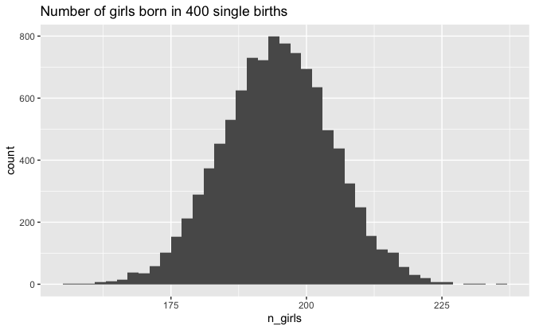
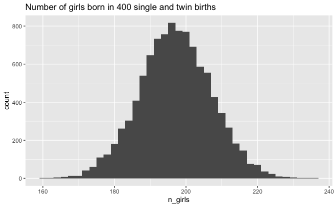
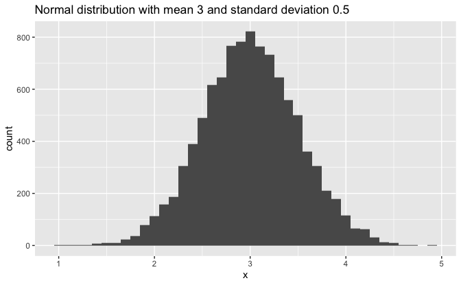
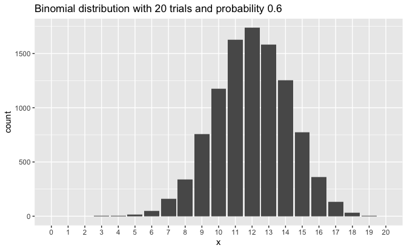
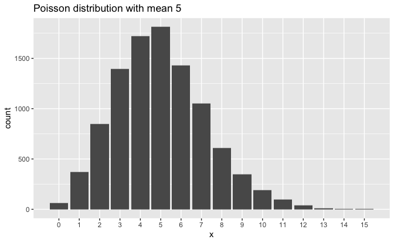
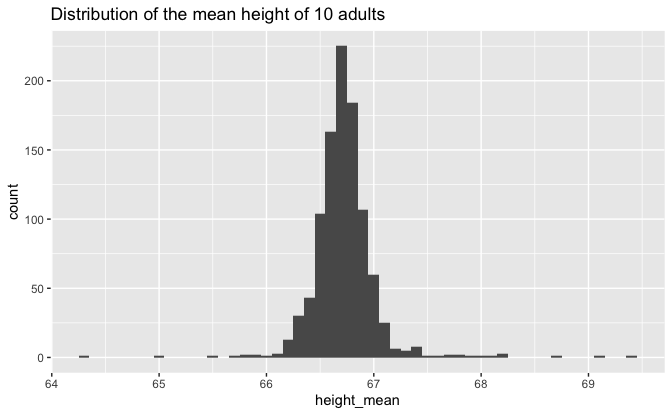
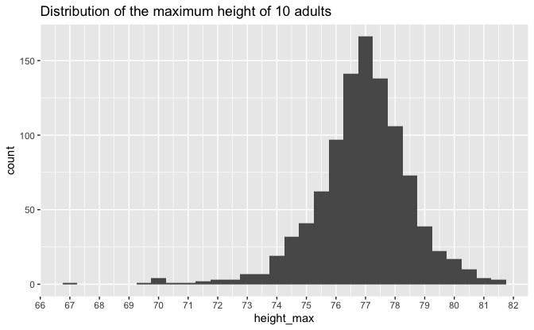

Regression and Other Stories: Simulation
================
Andrew Gelman, Jennifer Hill, Aki Vehtari
2020-12-18

-   [Simulation of dicrete probability
    models](#simulation-of-dicrete-probability-models)
    -   [Number of girls in 400 single
        births](#number-of-girls-in-400-single-births)
    -   [Number of girls in 400 single and twin
        births](#number-of-girls-in-400-single-and-twin-births)
-   [Simulation of continuous and mixed discrete / continuous
    models](#simulation-of-continuous-and-mixed-discrete-continuous-models)
    -   [Normal distribution](#normal-distribution)
    -   [Log-normal distribution](#log-normal-distribution)
    -   [Binomial distribution](#binomial-distribution)
    -   [Poisson distribution](#poisson-distribution)
    -   [Heights of adults](#heights-of-adults)

Tidyverse version by Bill Behrman.

Simulation of probability models. See Chapter 5 in Regression and Other
Stories.

------------------------------------------------------------------------

``` r
# Packages
library(tidyverse)

# Parameters
  # Common code
file_common <- here::here("_common.R")

#===============================================================================

# Run common code
source(file_common)
```

## Simulation of dicrete probability models

``` r
n_births <- 400
n_sims <- 1e4

prob_girl <- 0.488
```

### Number of girls in 400 single births

One observation.

``` r
set.seed(151)

rbinom(n = 1, size = n_births, prob = prob_girl)
```

    #> [1] 193

10000 observations.

``` r
set.seed(151)

sim_girl_1 <- 
  tibble(n_girls = rbinom(n = n_sims, size = n_births, prob = prob_girl))
```

``` r
sim_girl_1 %>% 
  ggplot(aes(n_girls)) +
  geom_histogram(binwidth = 2) +
  labs(title = "Number of girls born in single births")
```



### Number of girls in 400 single and twin births

``` r
set.seed(151)

prob_fraternal <- 1 / 125
prob_identical <- 1 / 300
prob_single <- 1 - prob_fraternal - prob_identical
prob_single_girl <- 0.488
prob_fraternal_girl <- 0.495
prob_identical_girl <- 0.495

n_girls <- function(n_single, n_fraternal, n_identical) {
  n_single_girls <- rbinom(n = 1, size = n_single, prob = prob_single_girl)
  v <- 
    rmultinom(
      n = 1,
      size = n_fraternal,
      prob = 
        c(
          (1 - prob_fraternal_girl)^2,
          2 * (1 - prob_fraternal_girl) * prob_fraternal_girl,
          prob_fraternal_girl^2
        )
    ) %>% 
    t() %>% 
    as_tibble(.name_repair = ~ c("n_girls_0", "n_girls_1", "n_girls_2"))
  n_fraternal_girls <- v$n_girls_1 + 2L * v$n_girls_2
  n_identical_girls <- 
    2L * rbinom(n = 1, size = n_identical, prob = prob_identical_girl)
  n_single_girls + n_fraternal_girls + n_identical_girls
}

sim_girls_2 <- 
  tibble(
    n_girls =
      rmultinom(
        n = n_sims,
        size = n_births,
        prob = c(prob_single, prob_fraternal, prob_identical)
      ) %>% 
      t() %>% 
      as_tibble(
        .name_repair = ~ c("n_single", "n_fraternal", "n_identical")
      ) %>% 
      pmap_int(n_girls)
  )
```

``` r
sim_girls_2 %>% 
  ggplot(aes(n_girls)) +
  geom_histogram(binwidth = 2) +
  labs(title = "Number of girls born in single and twin births")
```



## Simulation of continuous and mixed discrete / continuous models

### Normal distribution

``` r
set.seed(660)

mean <- 3
sd <- 0.5

v <- tibble(x = rnorm(n_sims, mean = mean, sd = sd))

v %>% 
  ggplot(aes(x)) +
  geom_histogram(binwidth = 0.1) +
  labs(
    title =
      str_glue(
        "Normal distribution with mean {mean} and standard deviation {sd}"
      )
  )
```



### Log-normal distribution

``` r
v %>% 
  ggplot(aes(exp(x))) +
  geom_histogram(binwidth = 2) +
  labs(title = "Corresponding log-normal distribution")
```


### Binomial distribution

``` r
set.seed(136)

size <- 20
prob <- 0.6

v <- tibble(x = rbinom(n_sims, size = size, prob = prob))

v %>% 
  ggplot(aes(x)) + 
  geom_bar() +
  scale_x_continuous(breaks = seq(0, size), minor_breaks = NULL) +
  coord_cartesian(xlim = c(0, size)) +
  labs(
    title =
      str_glue(
        "Binomial distribution with {size} trials and probability {prob}"
      )
  )
```



### Poisson distribution

``` r
set.seed(185)

lambda <- 5

v <- tibble(x = rpois(n_sims, lambda = lambda))

v %>% 
  ggplot(aes(x)) +
  geom_bar() +
  scale_x_continuous(breaks = seq(0, max(v$x)), minor_breaks = NULL) +
  labs(title = str_glue("Poisson distribution with mean {lambda}"))
```



### Heights of adults

``` r
n_sims <- 1000

prob_men <- 0.48
height_men_mean <- 69.1
height_men_sd <- 2.9
height_women_mean <- 64.5
height_women_sd <- 2.7
```

#### Mean height of 10 randomly chosen adults

``` r
height_mean <- function(n = 10) {
  if_else(
    rbinom(n, size = 1, prob = prob_men) == 1,
    rnorm(n, mean = height_men_mean, sd = height_men_sd),
    rnorm(n, mean = height_women_mean, sd = height_women_sd)
  ) %>% 
    mean()
}
```

One observation.

``` r
set.seed(815)

height_mean()
```

    #> [1] 66.1

1000 observations.

``` r
set.seed(815)

sim_height_mean <- tibble(height_mean = map_dbl(seq_len(n_sims), height_mean))
```

``` r
sim_height_mean %>%
  ggplot(aes(height_mean)) +
  geom_histogram(binwidth = 0.1) +
  labs(title = "Distribution of the mean height of 10 adults")
```



#### Maximum height of 10 randomly chosen adults

``` r
height_max <- function(n = 10) {
  if_else(
    rbinom(n, size = 1, prob = prob_men) == 1,
    rnorm(n, mean = height_men_mean, sd = height_men_sd),
    rnorm(n, mean = height_women_mean, sd = height_women_sd)
  ) %>% 
    max()
}
```

One observation.

``` r
set.seed(815)

height_max()
```

    #> [1] 71.4

1000 observations.

``` r
set.seed(815)

sim_height_max <- tibble(height_max = map_dbl(seq_len(n_sims), height_max))
```

``` r
sim_height_max %>%
  ggplot(aes(height_max)) +
  geom_histogram(binwidth = 0.5) +
  scale_x_continuous(breaks = scales::breaks_width(1)) +
  labs(title = "Distribution of the maximum height of 10 adults")
```


