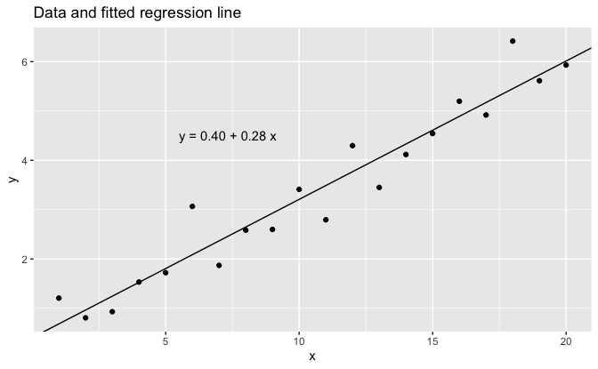

Regression and Other Stories: Simple regression
================
Andrew Gelman, Jennifer Hill, Aki Vehtari
2020-12-28

-   [Chapter 6](#chapter-6)
    -   [Simulate fake data](#simulate-fake-data)
    -   [Linear regression model](#linear-regression-model)
    -   [Plot](#plot)

Tidyverse version by Bill Behrman.

Linear regression with a single predictor. See Chapters 6 and 7 in
Regression and Other Stories.

------------------------------------------------------------------------

``` r
# Packages
library(tidyverse)
library(rstanarm)

# Parameters
  # Seed
SEED <- 2141
  # Common code
file_common <- here::here("_common.R")

#===============================================================================

# Run common code
source(file_common)
```

# Chapter 6

### Simulate fake data

``` r
set.seed(SEED)

intercept <- 0.2
slope <- 0.3
sigma <- 0.5

fake <- 
  tibble(
    x = 1:20,
    y = intercept + slope * x + rnorm(length(x), mean = 0, sd = sigma)
  )
```

### Linear regression model

The option `refresh = 0` suppresses the default Stan sampling progress
output. This is useful for small data with fast computation. For more
complex models and bigger data, it can be useful to see the progress.

``` r
fit_1 <- stan_glm(y ~ x, data = fake, seed = SEED, refresh = 0)

print(fit_1, digits = 2)
```

    #> stan_glm
    #>  family:       gaussian [identity]
    #>  formula:      y ~ x
    #>  observations: 20
    #>  predictors:   2
    #> ------
    #>             Median MAD_SD
    #> (Intercept) 0.40   0.23  
    #> x           0.28   0.02  
    #> 
    #> Auxiliary parameter(s):
    #>       Median MAD_SD
    #> sigma 0.49   0.08  
    #> 
    #> ------
    #> * For help interpreting the printed output see ?print.stanreg
    #> * For info on the priors used see ?prior_summary.stanreg

### Plot

``` r
fit_intercept <- coef(fit_1)[["(Intercept)"]]
fit_slope <- coef(fit_1)[["x"]]
eqn <- 
  str_glue(
    "y = {format(fit_intercept, digits = 2, nsmall = 2)} + ",
    "{format(fit_slope, digits = 2, nsmall = 2)} x"
  )

fake %>% 
  ggplot(aes(x, y)) +
  geom_abline(slope = fit_slope, intercept = fit_intercept) +
  geom_point() +
  annotate("text", x = 5.5, y = 4.5, label = eqn, hjust = 0) +
  labs(title = "Data and fitted regression line")
```


