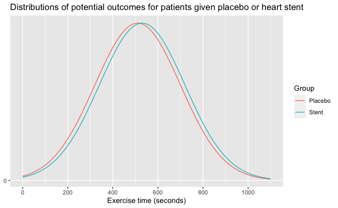

Regression and Other Stories: Stents
================
Andrew Gelman, Jennifer Hill, Aki Vehtari
2020-12-18

-   [Data](#data)
-   [Plot](#plot)

Tidyverse version by Bill Behrman.

Stents - comparing distributions. See Chapter 3 in Regression and Other
Stories.

------------------------------------------------------------------------

``` r
# Packages
library(tidyverse)

# Parameters
  # Common code
file_common <- here::here("_common.R")

#===============================================================================

# Run common code
source(file_common)
```

## Data

``` r
# Mean times for each group
time_control <- 510
time_treatment <- 530

# Standard deviations for each group
sd_control <- 190
sd_treatment <- 190
```

``` r
pnorm(time_treatment, mean = time_control, sd = sd_control)
```

    #> [1] 0.542

The mean time for the treatment group would have been in the 54th
percentile for the control group.

## Plot

``` r
x <- 
  seq(
    max(
      0,
      min(time_control - 3 * sd_control, time_treatment - 3 * sd_treatment)
    ),
    max(time_control + 3 * sd_control, time_treatment + 3 * sd_treatment),
    length.out = 101
  )
v <- 
  tibble(
    group = "Control",
    x = x,
    y = dnorm(x, mean = time_control, sd = sd_control)
  ) %>% 
  bind_rows(
    tibble(
      group = "Treatment",
      x = x,
      y = dnorm(x, mean = time_treatment, sd = sd_treatment)
    )
  )

v %>% 
  ggplot(aes(x, y, color = group)) +
  geom_line() +
  scale_x_continuous(breaks = scales::breaks_width(200)) +
  scale_y_continuous(breaks = 0) +
  labs(
    x = "Exercise time (seconds)",
    y = NULL,
    color = "Group"
  )
```


